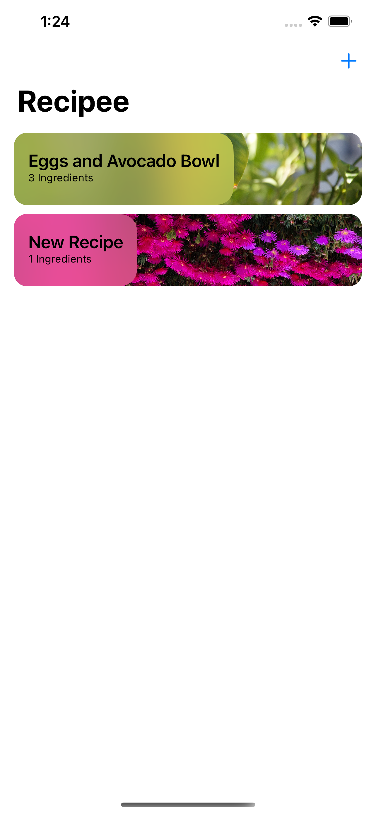
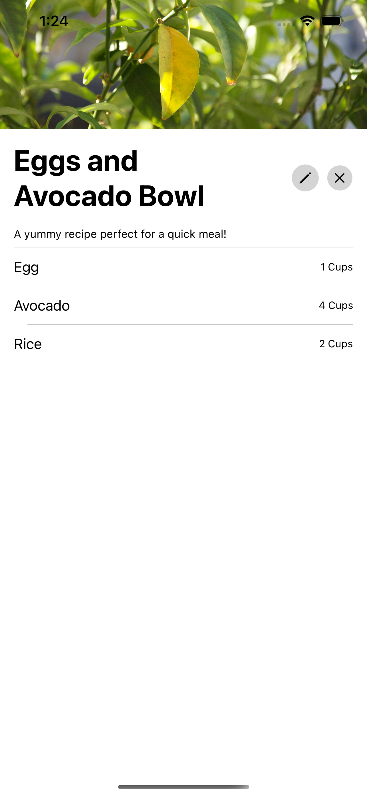
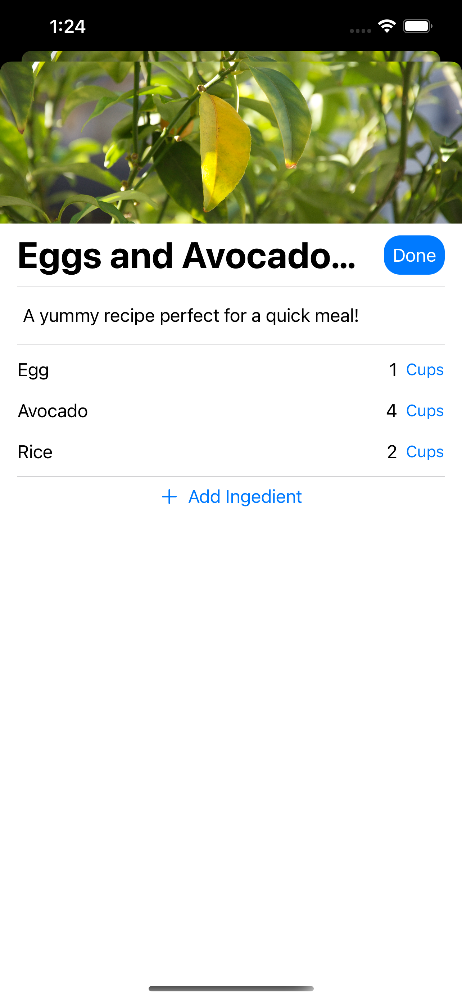

# Recipee

 This project demonstrates building a Recipe app named Recipee. You'll learn the basics of iOS development using SwiftUI, Data Modeling, and Swift.

In the end you'll have a working iOS app that can be used to record recipes and their ingredients in a list with images.

| Home View                         | Recipe Detail                       | Add/Edit a Recipe                 |
| --------------------------------- | ----------------------------------- | --------------------------------- |
|  |  |  |

### Skills learned:

- Build a simple, functional, UI using SwiftUI
- Basics of the Swift Programming Language
- Store and retreive data using the native File System and data encoders

### File Structure

This repo contains 6 folders:

- `start`
- `step1`,`2`, `3`, `4` and `5`
- `final`

`start` contains the beginning project, [you can download the starter project here](https://github.com/ADC-UMN/Recipee/raw/main/start/Recipee-start.zip) or follow the instructions in [the start folder](https://github.com/ADC-UMN/Recipee/start). **In each step we'll build on this starter project until we reach the project in `final`.**

Each step also contains the code that you should end up with after each step, so if you're lost you can download those folder's code and see what's going wrong.

### Steps

- Step 1: Intro to Swift, Xcode overview, overview of iOS development
- Step 2: Model
  - Create a data model to store recipes and ingredients
  - Create a Persistence layer object to handle model operations
  - Add a way to save and retrieve images for recipes.
- Step 3: Home View
  - Make a home view with cells that display a recipe's name, ingredient count, and a blurred image.
- Step 4: Recipe Detail
  - Add a detail view when you tap on the home cells that displays all the ingredients, the recipe name, and the recipe image.
- Step 5: Add a Recipe
  - Create a new view for adding recipe's and their ingredients, as well as edit recipes.