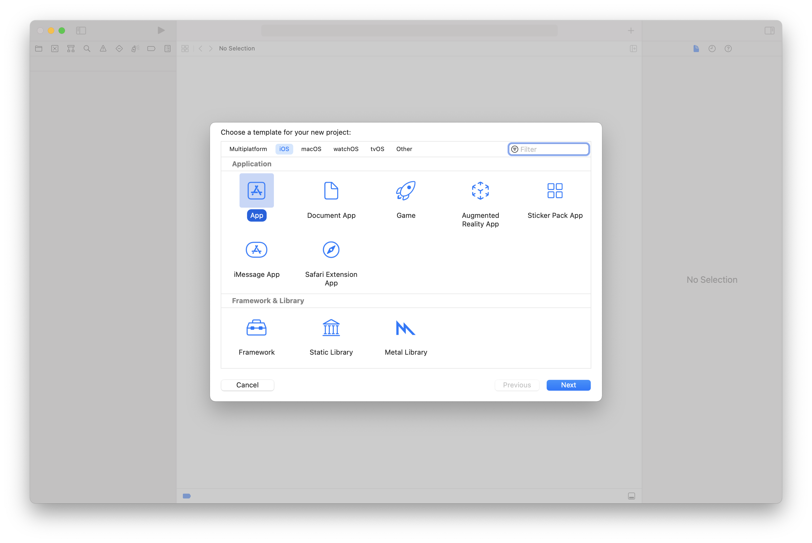
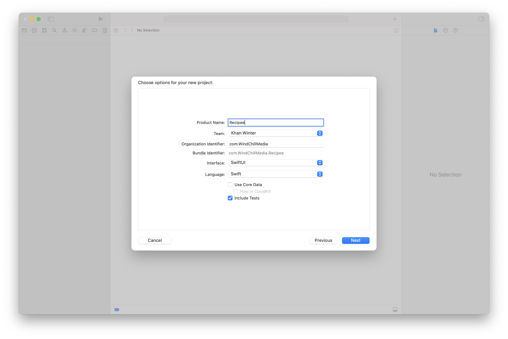
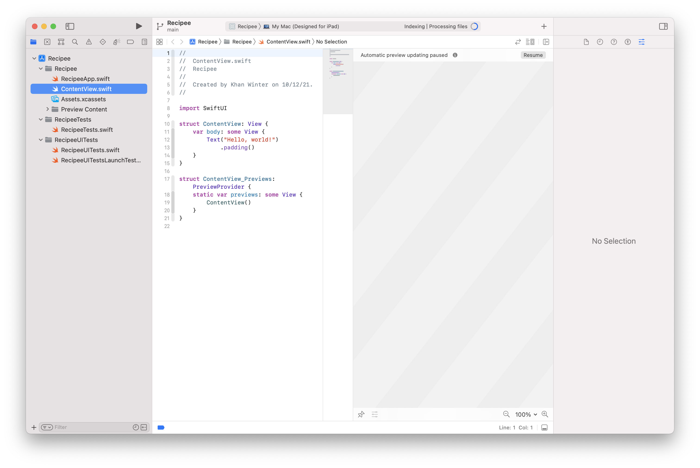

# Start - Recipee

This is the begining project you should use to start out. It contains everything you'd get by making the project yourself, but has a few assets and folders that will help get you started.

The link below will download the starter project in a `zip` file.

<a id="raw-url" href="https://github.com/ADC-UMN/Recipee/raw/main/start/Recipee-start.zip">Download Starter Project</a>

### If you want to do it yourself:

You can absolutely make your project from scratch. First open Xcode, once it's loaded press **⇧⌘N** to create a new project. From there click **App** → **Next**.

You'll now be presented with a screen where you'll choose your app's name, Bundle ID and other configuration. Enter whatever name you'd like, and create a bundle ID using the backwards URL format. It should be unique, so don't use the one that's in the screenshot. Some good ideas might be `com.google.recipee` or `com.adcumn.recipee`.

Also make sure `Core Data` is left unchecked, and you can choose to enable or disable tests. You can always add them later if you choose.

After this step, choose a place to store your project. It can be anywhere on your disk. 

You should now have a screen simliar to this:

And your project is done! You can continue to step 1 from here. If there are any missing files or folders that the starter project has, you'll have to create them in your project.
