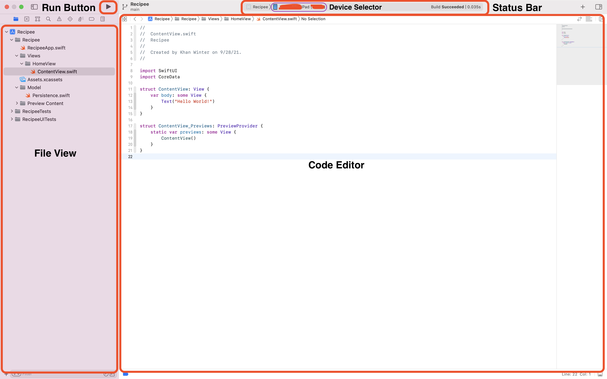
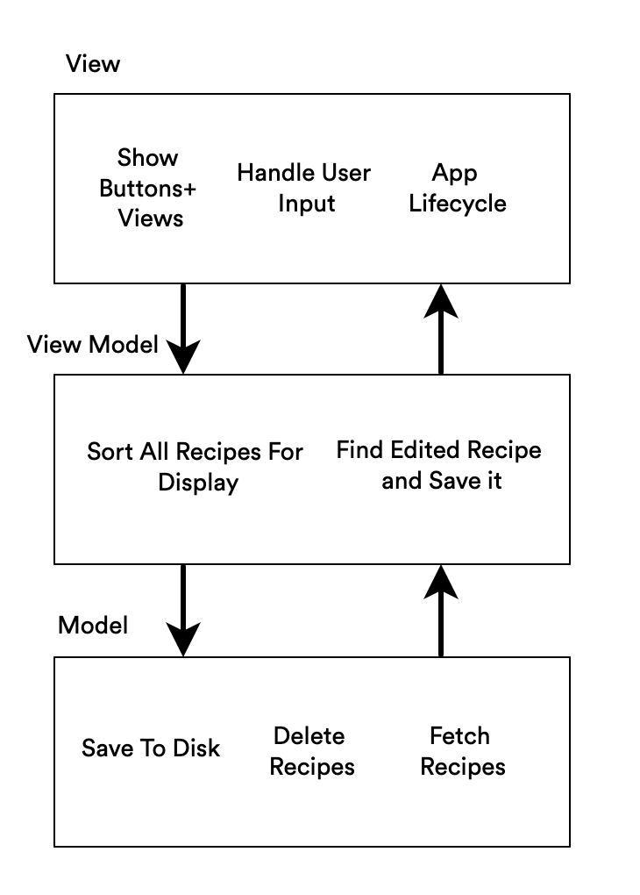

# Step 1 - Intro to Swift, Xcode, App Dev

Welcome to the App Developer Club's iOS workshop! This step will be giving you a quick introduction to the Swift programming language, Xcode, and an overview of iOS App architecture and why having an architecture is important.

## Swift

[Swift](https://swift.org/about/) is an open-source programming language. It's a statically-typed, compiled, general-purpose language with a focus on speed and simple syntax. I like to think of it as what comes out when you toss Java, Python and C++ in a blender and keep all the good parts.

According to Swift.org, *"Swift is a general-purpose programming language built using a modern approach to safety, performance, and software design patterns.".*

You can use it to program for all of Apple's platforms (iOS, iPadOS, MacOS, TvOS, WatchOS) as well as run web servers with frameworks like [Vapor](https://vapor.codes/). There's even some preliminary ports to Windows, but nothing very useful as of this writing

## Basic Syntax

**Variables**

Like in any other programming language, swift allows you to create variables. You can create constants using `let`, which can't be modified and variables using `var` that can be modified. 

Since Swift is a statically-typed language, we need to specify a type for each variable. However, for most variables the Swift compiler can take a good guess and add a type for us so it's not always necessary.

```swift
// Declare a variable with an explicit type
var message: String = "Hello World"
// Declare a constant with an inferred type (String)
let message2 = "Hello World"
```

**Functions**

Declaring a function in swift looks like

```swift
func editMessage(newMessage: String) {
    message = newMessage
}
```

You can pass parameters to a function by adding the `name: Type` inside the parenthesis. For more than one parameter add a `,` between each one like so: `param1: String, param2: Int`.

> Xcode also features a console that we can print data to using `print` like this.
>
> ```swift
> print(message)
> print("This is the message: ", message)
> ```

**Control Flow**

Swift supports basic `if, else if, else` statements like the below example. 

> Note, parenthesis are not required in `if`, `while`, or `for` statements and are considered bad in Swift

```swift
let isTrue = false

if isTrue {
    print("Yay!")
} else if isTrue == false && isTrue == true {
    print("We probably shouldn't be here...")
} else {
    print("Yay 2!")
}
```

`while` and `for` loops also work in swift, and `for` loops have some nice syntactic sugar that makes them look a lot like Python and Java for loops.

```swift
var testScores: [Int] = [0, 1, 50, 75, 76, 99, 100]

while testScores.count > 0 {
    testScores = []
}

// for _ in _ syntax
for score in testScores {
    print(score)
}

// for i in range syntax
for i in 0..<testScores.count {
    print(scores[i])
}
```

> While you *can* use C-style for loops (`for let i, i < 3, i++ {`) in Swift, it won't work in future Swift releases and you'll get a warning from the compiler.

### Classes

One of Swift's core features is it's ability to do Object-Oriented Programming easily. You can declare a working class with 3 lines of code.

```swift
class Messenger {
  
}
```

This class doesn't do much, but we can add variables and methods to it like so.

```swift
class Messenger {
    var currentMessage: String = "Hello World"
  
    func sendMessage() {
        currentMessage = "sent!"
    }
}
```

Classes will sometimes need to implement an `init` method. This method will give values to any variables that don't have an initial value in the class, and perform any other setup that needs to happen. For instance:

```swift
class Messenger {
    init() {
        // `currentMessage` has only a type, no value. So we need to give it a value in the
        // `init()` function.
        currentMessage = "Hello World"
    
        // Set up the class when it is created
        setupMessenger()
    }
  
    // Declare a private function
    private func setupMessenger() {
        // ...
    }
  
    var currentMessage: String
  
    func sendMessage() {
        currentMessage = "sent!"
    }
}
```

### Do-Catch

Some methods can 'throw' an error. For instance, when reading from a file multiple errors might occur. The file might not exist, the file is corrupted, etc. These functions need to be called in a do-catch block like so.

```swift
do {
    // Call a throwing function with the `try` keyword in front of it
    try sendErrorMessage()
} catch {
    // Handle any errors
    print(error)
}
```

In this example, `sendErrorMessage()` can throw an error. We wrap it in the do-catch block and add a `try` in front of the function call. 

In the `catch` block, there is a variable `error` that is implicitly declared and that we can use to handle the error.

**If you don't handle errors in this way, your code will crash when `sendErrorMessage` throws an error.**

### **Optionals (⚠️ Important)**

The major difference between Swift and other programming languages is Swift's idea of Optionals. An optional represents two possibilities: Either there *is* a value, and you can unwrap the optional to access that value, or there *isn’t* a value at all.

> Aside:
>
> This concept doesn't exist in C or C++. In Java, `null` variables simply cause a crash when you access them, same thing in Python.

This example shows how optionals can come in handy. We'll try to convert an `Int` to a string. Since this is something that could fail, the `String` function will just return `nil` if it didn't work.

```swift
let intToConvert: String = "420"
let string: Int? = Int(intToConvert)
```

Because the initializer might fail, it returns an *optional* `Int`, rather than an `Int`. An optional `Int` is written as `Int?`, not `Int`. The question mark indicates that the value it contains is optional, meaning that it might contain *some* `Int` value, or it might contain *no value at all*.

> Note: It can’t contain anything else, such as a `Bool` value or a `String` value. It’s either an `Int`, or it’s nothing at all.

You can clear a value in a variable by setting the variable to `nil`

```swift
var optionalString: String? = "Hello World"

print(optionalString) // ==> "Hello World"

optionalString = nil

print(optionalString) // ==> nil
```

You can also declare a variable with no value to begin with like this

```swift
var optionalString: String? = nil

print(optionalString) // ==> nil
```

We can *unwrap* an optional value in two ways. Either we provide a fallback value using `??` or we force unwrap the value using `!`

> Note: If you can avoid it, use `!` as little as possible as your code will crash if you force-unwrap a value that doesn't exist

```swift
// Fallback unwrap
let notOptionalString: String = optionalString ?? "Fallback Value"

// Force unwrap
let notOptionalString2: String = optionalString!
```

Optionals can come in handy when we want to **check** if a value exists in a variable. We can use a simple `if` statement.

```swift
if optionalString == nil {
    print("Looks like the string doesn't exist :(")
} else {
    // Force unwrap is save because we checked if it was `nil` already
    print(optionalString!)
}
```

## Xcode

Xcode is the IDE (Integrated Development Environment) that you'll need to use to develop iOS apps.

**You can [download it here](https://apps.apple.com/us/app/xcode/id497799835).**

> After downloading Xcode, you'll be presented with a dialog asking to install additional components. Make sure you install those components before continuing

After downloading Xcode, make sure to <a id="raw-url" href="https://github.com/ADC-UMN/Recipee/raw/main/start/Recipee-start.zip">download the starter project</a> for this workshop.

To open the project, open the `Recipee.xcodeproj` file to open it in Xcode.

### The Xcode Editor



Once you've opened the starter project, you should be presented with this screen. The screenshot above labels some of the main components in the editor. 

We'll be working in Xcode for the rest of this workshop, so make yourself comfortable and explore the editor a little bit.

### Useful Commands

There are some commands you'll need to know to build, run and debug your project:

- **⌘B => Build the project.** This command compiles the code in your project. It won't run it, but will give you compiler errors if they exist.
- **⌘R => Run the project.** Build, then run the project on the selected device.
- **⌘N => Add a New File.** This will bring up the new file dialoge, the amount of file options may seem overwhelming but we'll usually be choosing a regular `.swift` file.
- **⌘-Shift-K => Clean Project Build.** Xcode will cache compiled code to make build times faster, *if you're getting a super weird error when building or running, using this command sometimes fixes it.*

## App Architecture

App architecture is extremely important when building apps. There are many different ideas about architecture depending on who you're working with, what you're building (website, app, database, etc.) and how you're building it.

The core idea of an architecture is **[separation of concerns](https://en.wikipedia.org/wiki/Separation_of_concerns)**. Separation of concerns is a way of creating apps that divides resposibilities into different *sections*, and gives them each a resposibliity. These sections should be able to act alone, and be hooked into each other to create a whole app.

The architecture we'll be using is called **MVVM**, which stands for **Model, View, View Model**. Each of those three components will handle a different concern of our app.

1. **Model**
   1. The *model* should handle all data concerns. This includes writing data to disk, fetching resources from a server, or performing operations on our data model. We'll be building this layer of our architecture in Step 2.
2. **View**
   1. The *view* is concerned with presenting a UI to the user. This layer will handle things like presenting and hiding a button, showing other views, and performing animations. This will be built in steps 3 and 4.
3. **View Model**
   1. The *view model* is a special data model the *View* will use to interface with the *model*. It acts as a "glue" layer that transforms the data in the *model* to something that's easier for the *view* to use. We'll be building this layer as we build the *View* layers.


