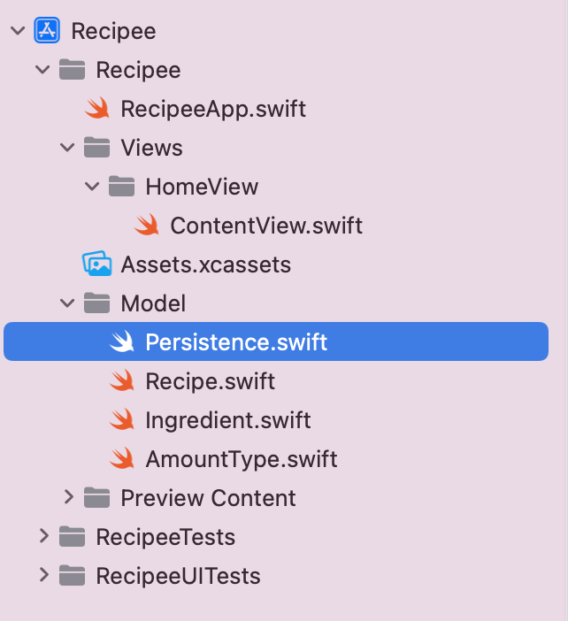

# Step 2 - Data Model

Our app needs to be able to store and load data. Because Recipee will loose all data that's stored in memory when the app closes, we need a way to write our stored data to the device's disk. To do this, we'll be implementing a `PersistenceController`. An object that will handle fetching, saving and deleting recipes.


This object is the **Model** part of our **MVVM** app architecture. It will make sure that any UI we create won't have to handle saving and loading data, keeping track of save files, and deleting recipes. We'll be implementing some methods that let our views simply call `PersistenceController.loadAllSavedRecipes()` and not have to know whats going on behind the scenes, only that our recipes will be loaded.


There is a starter template for this object in the `Persistence.swift` file under `Model`.



When you open the file, you should see a few variables, an `init` method and the class definition at the top. If you scroll down a little bit further you'll see there's 4 functions that need to be implemented: `fetchAllSavedRecipes`, `save`, `deleteRecipe` and `getSavedRecipe`. We'll be implementing those functions in this step.

### Codable

We'll need to be able to convert our model objects to data that we can store on disk. One really handy way to do this is to convert them to JSON strings, and save those strings. 

> If you don't know what JSON is, [here's a handy starter.](https://www.tutorialspoint.com/json/json_overview.htm)

We've given you the object's we'll be using, and we covered them in the first step. You can take a look at `Recipe`, `Ingredient` and `AmountType` and you'll see that they all conform to `Codable`.

```swift
//    Name    Types this class conforms to
class Recipe: ObservableObject, Codable, Identifiable, Equatable {
//                               ^ Conforms to Codable
```

Since our objects conform to codable we can use two classes called `JSONEncoder` and `JSONDecoder` to convert our objects to and from JSON data.

Here's how we do that.

```swift
// Create a recipe
let recipe: Recipe = Recipe(name: "Test Recipe", notes: "", ingredients: [])

// Create an encoder
let encoder = JSONEncoder()

// Encode the recipes to JSON data
let data: Data = try encoder.encode(recipe)
```

And to decode that data.

```swift
// Create a decoder
let decoder = JSONDecoder()

// Decode the data
let recipe: Recipe = try decoder.decode(Recipe.self, from: data)
```

We'll be making heavy use of `Codable`, `JSONDecoder`, and `JSONEncoder` in this step, so make sure the above part is understandable.

### Writing Data to Disk

Now that we have a format we can save our objects in (after converting them to JSON data), we need to be able to write that data to disk. Luckily, Swift makes this incredibly easy.

First, we'll need a URL to write the file to. I'm sure you've seen URLs that lead to internet addresses, usually in the form of

```
http://example.com/page
```

But URLs can also lead to files using a format like this

```
file://path/to/file.pdf
```

File URLs are handy for pointing towards a location on disk to store data. In our case, we'll be storing our data in a `recipes.data` file. 

In `PersistenceController`, you should see a `saveDirectory` constant towards the top of the file. This is the `URL` where we'll save our data. It fetches our app's `documents` directory, and appends a `recipes.data` path to the end.

Now all we have to do is write our data to that URL.

The `Data` type that we converted our objects to, has a nice function `write(to: URL)`.

To use this to save our models to disk we can combine this with the JSON encoding above to get something like this

```swift
// Create a recipe
let recipe: Recipe = Recipe(name: "Test Recipe", notes: "", ingredients: [])

// Create an encoder
let encoder = JSONEncoder()

// Encode the recipes to JSON data
let data: Data = try encoder.encode(recipe)

// Write the data to file, use saveDirectory as the URL to save to.
try data.write(to: saveDirectory)
```

### Read Data

Reading data is just as easy with swift. Since we have a URL that will always point towards our save file all we have to do is load a `Data` object from that file and decode it.

```swift
// Get the data in our save file
let data: Data = try Data(contentsOf: saveDirectory)

// Make a decoder object
let decoder = JSONDecoder()

// Decode the data into a variable
let recipe: Recipe = try decoder.decode(Recipe.self, from: data)
```

### Persistence Controller

Now that we've seen how to save and load Swift objects to files, lets fill in the functions we'll need in `PersistenceController`.

------

First, `fetchAllSavedRecipes` should grab data from our save file, decode it into Recipes, and then put those recipes into the `recipes` array.

```swift
func fetchAllSavedRecipes() {
  // Check first if the save file exists
  // If it doesn't make a new, empty one.
  if !FileManager.default.fileExists(atPath: saveDirectory.path) {
    save()
  }

  do {
    // Get the data from the save file
    let data = try Data(contentsOf: saveDirectory)
    let decoder = JSONDecoder()
    // Decode the data into the recipe array
    recipes = try decoder.decode([Recipe].self, from: data)
  } catch {
    // If something went wrong getting the data or decoding it,
    // we'll get it here and print it.
    print("Something went wrong fetching the saved recipes:", error)
  }
}
```

First, we check if the save file exists. If it doesn't we need to make it and can assume there are no recipes. So we call `save()` which we'll fill in later.

Then, we fetch the data in the save file, and decode it into a recipe array (`[Recipe]`). Finally we put it into the `recipes` variable and return.

Since some of the functions we're calling (`Data(contentsOf:) and decoder.decode`) can throw errors, we have to wrap that section of the code in a `do catch` block. We talked about this block in step 1, and if you don't remember what it does I'd suggest going back and reading it.

> I've added fetchAllSavedRecipes to PersistenceController's `init` method so whenever we make a new controller the recipes are fetched. I'd highly suggest you do the same:
>
> ```swift
> init() { // (Line 26 in PersistenceController.swift)
> 	fetchAllSavedRecipes()
> }
> ```

------

Now for the `save()` function. We'll encode the recipes array into a `Data` object and write that data to our save file.

```swift
/// Save the `recipes` array to the `saveDirectory` file.
func save() {
    do {
        let encoder = JSONEncoder()
        // Encode the recipes to JSON data
        let data = try encoder.encode(recipes)
        // Save that data to disk
        try data.write(to: saveDirectory)
    } catch {
        // If something went wrong encoding the recipes to data,
        // or if something went wrong saving the data to disk we'll have that error here.
        print("Something went wrong saving the recipes:", error)
    }
}
```

------

We'll also want to delete recipes in our app, so lets fill in the `deleteRecipe` function.

The function is given a recipe `r` to use to delete the recipe. First find the recipe in the `recipes` array. Then remove the recipe from `recipes` and save the new recipes array!

```swift
func deleteRecipe(_ r: Recipe) {
    // Find the index of the recipe in the `recipes` array.
    if let index = recipes.firstIndex(where: { recipe in
        recipe.id == r.id
    }) {
        // If we find it, remove it
        recipes.remove(at: index)
    }
    
    // Save the recipes to disk.
    save()
}
```

------

Finally, lets fill in `getSavedRecipe`. This function will return a recipe identified by the given ID if it exists.

```swift
func getSavedRecipe(for id: String) -> Recipe? {
  	// Find the recipe in the `recipes` array.
    if let index = recipes.firstIndex(where: { recipe in
        recipe.id == id
    }) {
        // We've found the recipe, return it.
        return recipes[index]
    } else {
        // This recipe doesn't exist, return nil
    	  return nil
    }
}
```


### Conclusion

You've now implemented a working data class. This class `PersistenceController` will be the backbone for the rest of the app, and will be able to save and load any recipe a user creates, deletes or wants to find. Nice job! 

